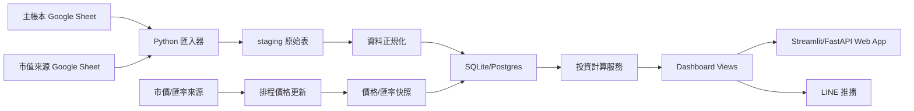

# 投資系統線上化藍圖

本文件根據兩份 Google Sheet 匯出的 `.xlsx` 做第一輪結構分析：

- 主帳本：`19GikXQGPMl0Uoorh9eGs2CEYJIcj8Ybh6zhXcos-kQ0`
- 市值來源：`17HPytZKOPR_9Od_wor-xEx9kpccJlPS2v6B0Dz6MRYc`

結論：可以用 Python 線上化，而且建議先做成「讀 Google Sheet 的線上儀表板」，再逐步把資料寫入與公式計算搬進資料庫。不要一次把所有 Sheet 都改寫，因為目前工作簿同時扮演資料庫、計算引擎、儀表板、推播控制台與手動備註區。

## 目前已建立的第一版檔案

| 檔案 | 用途 |
| --- | --- |
| `app.py` | Streamlit 只讀 MVP，讀取兩份 Sheet 的本機快取或 Google Sheet 匯出檔 |
| `schema.sql` | SQLite/Postgres 初版資料表設計 |
| `requirements.txt` | 第一版 Python 需求套件 |

本機啟動：

```bash
cd "/Users/jenny/Documents/New project/investment-system"
streamlit run app.py
```

## 現況整理

### 主帳本

主帳本共 39 個工作表，主要角色如下：

| 類型 | 工作表 | 線上化後角色 |
| --- | --- | --- |
| 儀表板/控制 | `總覽`, `Jennyall`, `📱控制面板` | 儀表板、整體資產摘要、LINE 推播設定 |
| 月收入/配息 | `每月收入`, `境內外`, `配息月份`, `保險` | 月收入彙總、股利/利息/基金配息、保險回饋 |
| 投資持倉 | `台股`, `渣打-美股`, `基富通-台`, `基富通-人民幣`, `基富通-日幣`, `渣打-美金`, `渣打-南非`, `台新-美金`, `台新-南非`, `債券`, `LINE記帳` | 持倉批次、買入成本、市值、損益、配息 |
| 現金流/借款 | `2023細帳`, `2024細帳`, `2025細帳`, `2026細帳`, `2027細帳`, `Uncle` | 月現金流、銀行帳戶餘額、借入/借出/代墊 |
| 非上市/個人投資 | `懷思`, `懷思股東明細`, `奈米投`, `本生投資報酬` 等 | 非公開投資、股東明細、私募/個人投資 |
| 非核心生活帳 | 旅行、淘寶、雜表 | 先保留於 Google Sheet 或另做個人支出模組 |

公式特徵：

- `SUMIF` 1,370 次，`SUMIFS` 584 次，`VLOOKUP` 259 次。
- `IMPORTRANGE` 15 次，代表主帳本已經把其他工作簿當資料來源。
- `GOOGLEFINANCE` 13 次，主要用於匯率與部分市價。
- `Jennyall`、`總覽`、`每月收入` 是核心彙總節點；`2026細帳` 會餵給 `每月收入` 與 `Jennyall`。

### 市值來源

市值來源共 22 個工作表，主要是投資部位與最新市值：

| 類型 | 工作表 | 線上化後角色 |
| --- | --- | --- |
| 總覽 | `總覽`, `總表` | 市值總覽、歷史/分類彙總 |
| 台股 | `台股`, `「台股」的副本`, `渣打-美股` | 台股/美股持倉與市價 |
| 基金/券商 | `基富通-台`, `基富通-人民幣`, `基富通-日幣`, `渣打-美金`, `渣打-南非`, `台新-美金`, `台新-南非` | 基金批次、成本、市值、單位數、配息 |
| 配息 | `配息月份`, `股票股利月份`, `每月收入` | 配息日曆與月收入來源 |
| 其他投資 | `懷思股東明細`, `奈米投`, `本生投資報酬` | 非公開投資資料 |

公式特徵：

- `SUMIF` 6,317 次，`TEXT` 2,637 次，`VLOOKUP` 874 次。
- `GOOGLEFINANCE` 175 次，表示它才是主要市價/匯率變動來源。
- 最重的表為 `台新-南非`, `基富通-台`, `渣打-美金`, `基富通-日幣`, `渣打-南非`。
- 目前主帳本中的市值變動應視為「引用結果」，未來系統應以這份作為 `market_price_snapshot` 與 `portfolio_snapshot` 的來源。

## 為什麼 Google Sheet 會變慢

目前 Sheet 的負擔不是單一檔案大小，而是這幾件事疊在一起：

1. 大量跨表公式：`SUMIF/SUMIFS/VLOOKUP/FILTER/MATCH` 反覆掃整欄。
2. 外部資料來源：`IMPORTRANGE`, `GOOGLEFINANCE`, `IMPORTXML` 會等外部服務回應。
3. 寬表結構：月份橫向展開，例如 `2026細帳` 是「項目列 x 月份欄」，人類好讀但資料庫難查。
4. 儀表板與原始資料混在一起：`總覽` 直接拉很多表的結果，任何一處錯誤都會連鎖。
5. 部分表已有 `#REF!`, `#DIV/0!`, `#N/A`，線上化時要先把錯誤變成可追蹤的資料健康檢查。

## 建議線上系統架構

第一版建議用 Streamlit，因為你的現有 Python 工具多半也是 Streamlit 型態，部署與維護成本最低。等資料穩定後，再拆出 FastAPI 後端。



建議分層：

| 層級 | 責任 | Python 實作 |
| --- | --- | --- |
| Import | 下載/讀取 Google Sheet、保留原始資料 | `gspread`, Google Drive export, `pandas`, `openpyxl` |
| Staging | 每個工作表原樣落地，方便比對 | SQLite/Postgres staging tables |
| Normalize | 把寬表轉成長表、統一日期/幣別/帳戶/標的 | pandas ETL 或 SQLAlchemy |
| Calculation | 成本、市值、損益、配息率、月收入 | Python service + SQL views |
| Dashboard | 總覽、收入、持倉、損益、現金流 | Streamlit first |
| Notification | LINE 推播、資料錯誤提醒 | 排程 job |

## 資料表模型

核心表設計見 [`schema.sql`](schema.sql)。

最重要的觀念是把現有 Sheet 拆成四類資料：

1. **原始事件**：買入、賣出、配息、利息、保險回饋、借款、轉帳。
2. **狀態快照**：某日現金餘額、某日市價、某日匯率、某日總市值。
3. **主檔**：帳戶、券商、基金/股票標的、幣別、分類。
4. **衍生報表**：總覽、月收入、損益、配息率、資產配置。

### Sheet 對應表

| 現有 Sheet | 轉換後資料表/檢視 |
| --- | --- |
| `2026細帳`, `2025細帳`, `2024細帳` | `monthly_ledger_entries`, `cash_account_snapshots`, `loan_events`, `transfer_events` |
| `每月收入` | `monthly_income_summary` view，由 `income_events` 彙總 |
| `境內外` | `income_category_summary` view |
| `配息月份`, `股票股利月份` | `distribution_calendar`, `income_events` |
| `基富通-*`, `渣打-*`, `台新-*` | `holding_lots`, `transactions`, `income_events`, `portfolio_snapshots` |
| `台股`, `「台股」的副本`, `渣打-美股` | `instruments`, `holding_lots`, `market_price_snapshots` |
| `保險` | `insurance_policies`, `insurance_cashflows` |
| `懷思`, `懷思股東明細`, `奈米投` | `private_investments`, `private_investment_cashflows` |
| `Uncle` | `loan_accounts`, `loan_events` |
| `總覽`, `Jennyall`, `總表` | 不存原始資料，改為 dashboard views |

## MVP 介面建議

第一階段先做「只讀 Dashboard」，不要直接取代 Google Sheet 輸入。

1. **總覽**
   - 總資產、投資市值、現金、保險、借款/待收。
   - 依分類：台股、基金、美股、銀行、保險、非上市投資、借款。

2. **投資持倉**
   - 標的、券商/平台、幣別、成本、市值、未實現損益、累積配息、配息率。
   - 可以下鑽到每一筆買入批次。

3. **每月收入**
   - 股票股利、銀行利息、基金配息、懷思/保險收入。
   - 月趨勢與年度累計。

4. **現金流/細帳**
   - 每月支出、薪資、銀行餘額、轉帳、借入/借出。
   - 先支援瀏覽與比對，後續再支援新增交易。

5. **市值來源與資料健康**
   - 第二份 Sheet 的最新同步時間。
   - 哪些標的價格失敗、匯率失敗、`#REF!/#N/A/#DIV/0!`。

6. **LINE 推播**
   - 沿用目前控制面板功能，但改由 Python 排程讀資料庫後推播。

## 分階段落地

### Phase 1：只讀線上 Dashboard

- Python 直接讀兩份 Google Sheet。
- 顯示 `總覽`、`每月收入`、市值來源、資料錯誤。
- 不改資料，風險最低。
- 完成後可以先取代「打開很慢的 Sheet 來查看」這件事。

### Phase 2：資料庫與對帳

- 建 SQLite/Postgres。
- 匯入兩份 Sheet 到 staging。
- 正規化核心表。
- 做 reconciliation：Python 算出的總資產、月收入、各平台市值要能對回 `總覽`。

### Phase 3：交易與收入輸入改到系統

- 新增交易、配息、利息、保險回饋、借款/轉帳。
- Google Sheet 變成備份/匯出，而不是主要輸入介面。

### Phase 4：市價/匯率自動更新

- 台股/美股/基金/匯率改由 Python 排程抓取。
- 第二份市值表逐步退居人工校正來源。

### Phase 5：完整線上系統

- 權限登入。
- 多裝置瀏覽。
- 自動 LINE 推播。
- 資料健康警示。
- 月報/年報匯出。

## 需要你確認的決策

1. 第一版要用 **Streamlit** 快速上線，還是直接做 **FastAPI + 前端**？
2. 資料庫要先用 **SQLite**，還是直接部署 **Postgres**？
3. Google Sheet 未來要保留為輸入來源，還是只作備份？
4. 市價來源要繼續沿用 GoogleFinance/MoneyDJ，還是希望逐步換成 Python API？
5. LINE 推播要推哪些重點：總資產、日損益、月收入、價格錯誤、配息提醒？

我的建議是：先做 Streamlit + SQLite 的只讀版，跑穩後再把輸入功能搬進系統。

## 2026-05-22 更新：月配息估算與線上總表

- `invesapp_supabase.py` 已修正預估每月配息：基金會優先使用 GAS/MoneyDJ 抓到的每單位配息，若尚未填現在股數，會用市值股數估算。
- 新增 `📒 線上總表` tab，直接讀取主帳本的 `2026細帳`、`每月收入`、`資產總覽` 三個 Google Sheet gid，先用唯讀方式把銀行現金與統整表搬到線上查看。
- `supabase_schema.sql` 補上 `is_reinvest`、`dividend_pay_date`、`fund_dividends`、`dividend_log`、`portfolio_snapshots`，讓目前 app 會用到的表結構可一次建立。

美股與基金現值更新說明
主檔：invesapp_supabase.py

這次只處理兩件事：

美股、基金要先抓到即時價格 / 淨值，才能算出台幣現值。
「投資管道明細」併入「所有投資管道總覽」卡片，卡片直接顯示現值 / 成本、損益 / 淨利率。
已更新內容
美股：

先用 Yahoo Finance。
Yahoo 抓不到時，改用 Google Finance fallback。
Google Finance 會用 ticker + exchange 定位價格資料，例如 PYPL:NASDAQ、XYZ:NYSE。
只要價格與匯率都有抓到，狀態就顯示成功。
基金：

MoneyDJ 基金使用 fund_code + fund_pattern，例如 acft94 + yp010000。
鉅亨基金可用代碼格式，例如 A45089；fund_pattern 可填 anue，或留空讓程式自動判斷。
acft94 目前優先走鉅亨 A45089 API；MoneyDJ 連線失敗時也能抓到 2026/05/18 的淨值 3.3545。
MoneyDJ 頁面用 Big5 內容解析，優先抓基金頁上方淨值表格。
總覽卡片：

第一列顯示現值。
第二列顯示成本。
下方顯示 損益 / 淨利率。
卡片底下會顯示抓價狀態：抓價 ✓ 或 價格缺 N｜匯率缺 N｜股數缺 N。
原本下方的「投資管道明細」表格已移除，避免重複顯示。
自行更新步驟
到 GitHub 開啟 invesapp_supabase.py。
用本機這份檔案內容更新 GitHub 上的同名檔案。
Streamlit Cloud 會重新部署；若沒有自動部署，按 Reboot app 或重新部署。
進入 app 後按上方 更新即時價。
到 抓價測試 分頁測：
美股：PYPL、XYZ
MoneyDJ 基金：acft94 + yp010000
鉅亨基金：A45089 + anue
若現值仍是 0
先看卡片底下是否顯示 價格缺 或 匯率缺。
如果是美股價格缺：
確認 ticker 是否正確。
確認 US_STOCK_EXCHANGES 內是否有正確交易所，例如 PYPL: NASDAQ、XYZ: NYSE。
如果是基金價格缺：
MoneyDJ 確認 fund_code 與 fund_pattern 都有填。
鉅亨基金確認代碼類似 A45089，fund_pattern 填 anue。
